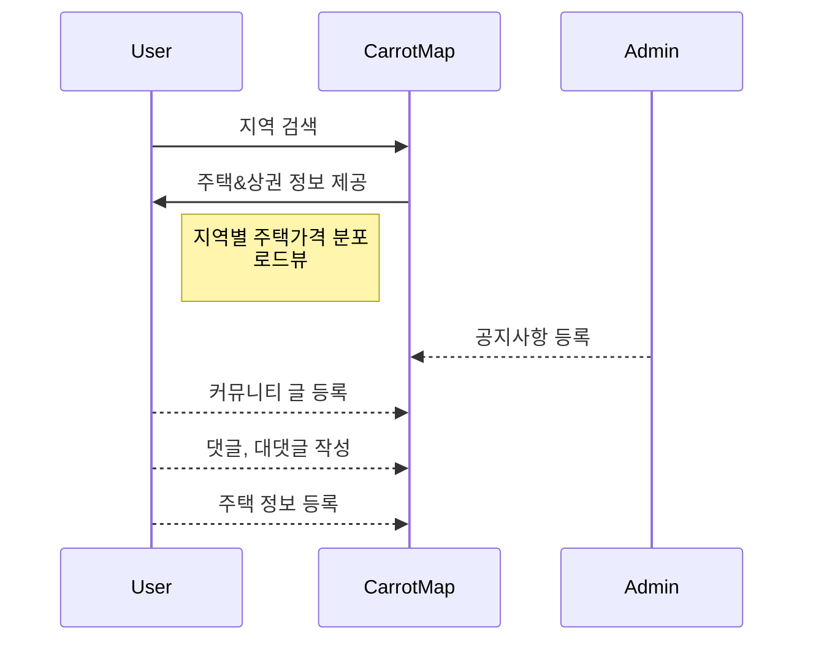

# CarrotMap


CarrotMap은 주택 거래를 위한 웹서비스 입니다. 카카오 맵 API와 공공데이터포털의 오픈 API를 활용해 지역별 주택 실거래가과 주변 상권 정보를 함께 제공해 사용자의 의사결정을 도와줍니다.


 1. Housing & Commercial Info Service
	 - 지역별 주택 실거래가 정보를 확인할 수 있습니다.
	 - 지도를 통해 해당 지역의 상권 정보를 확인할 수 있습니다.
	 - 해당 지역의 주택 가격 분포 정보를 확인할 수 있습니다.
	 - 로드뷰 서비스를 제공합니다.
	 - 주택 매물 등록 서비스를 제공합니다.

 2. Community Service
	 - 사용자가 자유롭게 게시글을 등록할 수 있습니다.
	 - 댓글과 대댓글, 좋아요와 싫어요 서비스를 제공합니다.

3. Notice Service
	- 관리자 페이지에서 등록한 공지사항 게시글을 확인할 수 있습니다.
	- 댓글, 대댓글 서비스를 제공합니다.


##  개발 환경

> - IDE : STS(Spring Tool Suite3)
> - Git Tools : Git Bash, Source Tree
 >- OS : Window10
 
 >- SpringBoot : 2.3.5.RELEASE
 >- JDK 1.8
 >- Maven
 >- MySQL 8.0

 
 
 

## 목차
여기에 링크넣고싶은데!!

## 시작하기
아래의 방법을 따르면 프로젝트를 실행시킬 수 있습니다.


### 시작하기에 앞서
기본 개발환경을 세팅해주세요!

### 1. Git Clone
 ```
 $ git clone https://github.com/sumin416/PenetratePJT_CarrotMap.git 
 ```

### 2. Import Project 

 - [x] 소스코드를 STS에서 import 해주세요!


### 3. Customizing

 - [x] src/main/resources/application.properties 설정
 여기에 이미지 넣기
 - [x] 데이터베이스  구축
 [sql 파일 다운로드]()
 
 

	
### 4. Run Project
1. Run CarrotMap Project in STS
2. Enter url for your browser
	```
	http://localhost:포트번호/
	```


## ERD


## UML diagrams



